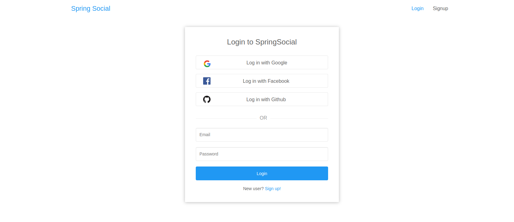

### O que é o Login Social?

Basicamente, o Login Social é uma técnica que permite que os sites utilizem informações existentes em redes sociais em suas rotinas de cadastro. Ela é muito utilizada para facilitar o processo de cadastro e login de novos usuários, uma das mais cansativas.

Dessa forma, o usuário não precisa preencher todo o formulário de cadastro com suas informações, apenas selecionar a rede social que ele já possui conta e reutilizar os dados cadastrados, como exemplificado na imagem abaixo:



### O projeto

Nesse repositório contém uma implemntação de como realizar o login social utilizando as ferramentas do Spring Security.

## Build do Backend (social-backend)

Adicione o seu clientId e Secret obtidos na configuração do Provedor. [Google API console](https://console.developers.google.com/projectselector/apis/credentials?pli=1)
```
spring.security.oauth2.client.registration.google.clientId=${GOOGLE_CLIENT_ID}
spring.security.oauth2.client.registration.google.clientSecret=${GOOGLE_PASSWORD}
```

Certifique-se de que http://localhost:8080/oauth2/callback/<provider> seja adicionado como um uri de redirecionamento autorizado no provedor OAuth2. Por exemplo, em seu console de API do Google, certifique-se de que http://localhost:8080/oauth2/callback/google seja adicionado nos URIs de redirecionamento autorizado, **Authorized redirect URIs**


Run backend
```
 mvn spring-boot:run
```


## Build do Backend (social-frontend)

```
cd social-frontend
npm install && npm start
```

Credits: [visit](https://github.com/callicoder/spring-boot-react-oauth2-social-login-demo)
